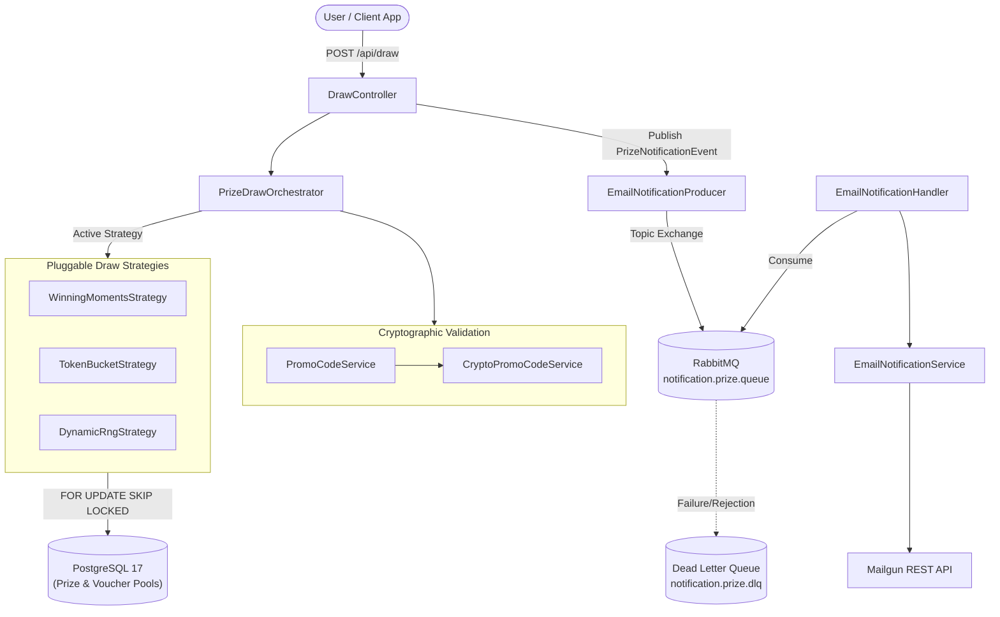

# Brepsi Prize Draw System 🥤🎁

[](https://openjdk.org/)
[](https://spring.io/projects/spring-boot)
[](https://www.postgresql.org/)
[](https://www.rabbitmq.com/)
[](https://www.mailgun.com/)

High-performance, event-driven promotional prize draw and voucher distribution platform developed for the **Brepsi** (*"Taste The Jora"*) promotional campaign.

The platform processes high-concurrency user entries, performs cryptographic validation of offline promo codes, executes configurable prize draw algorithms in real time, issues consolation vouchers, and delivers asynchronous prize notifications via RabbitMQ and Mailgun.

---

## Table of Contents

- [Key Features](#key-features)
- [System Architecture](#system-architecture)
- [Prize Draw Strategies](#prize-draw-strategies)
- [Cryptographic Promo Codes Engine](#cryptographic-promo-codes-engine)
- [Tech Stack](#tech-stack)
- [Database Schema & Migrations](#database-schema--migrations)
- [Getting Started](#getting-started)
  - [Prerequisites](#prerequisites)
  - [Environment Configuration](#environment-configuration)
  - [Starting Infrastructure Services](#starting-infrastructure-services)
  - [Building and Running the Application](#building-and-running-the-application)
- [API Reference](#api-reference)
  - [Prize Draw](#1-prize-draw)
  - [Authentication](#2-authentication)
  - [Admin Management](#3-admin-management)
  - [Marketing Statistics](#4-marketing-statistics)
- [Error Handling](#error-handling)
- [Configuration Reference](#configuration-reference)

---

## Key Features

- **Dynamic Algorithm Switching**: Real-time hot swapping between three prize distribution strategies (`WINNING_MOMENTS`, `TOKEN_BUCKET`, `DYNAMIC_RNG`) stored persistently in the database without service restarts.
- **High Concurrency & Atomic Prize Allocation**: PostgreSQL `SELECT ... FOR UPDATE SKIP LOCKED` locking guarantees safe, race condition-free prize claiming under heavy traffic loads.
- **Cryptographic Promo Codes**: 10-character Base32 codes utilizing HMAC-SHA256 signatures and integer scrambling, enabling instant mathematical validation before database queries.
- **Guaranteed Consolation Prize**: Every non-winning valid entry is instantly awarded a unique €10 discount voucher from a pool of 1,000,000 pre-generated codes.
- **Asynchronous Event-Driven Notifications**: Non-blocking prize email dispatch powered by RabbitMQ topic exchanges, durable queues, Dead Letter Exchanges (DLX/DLQ), and the Mailgun API.
- **JWT & Role-Based Security**: Role-based access control (`ADMIN`, `STAFF`) protecting management and statistical analytics endpoints.
- **Marketing Insights**: Real-time aggregation of supermarket distribution points and consumer merchandise preference trends.

---

## System Architecture



---

## Prize Draw Strategies

The system implements the Strategy Pattern via [`PrizeDrawStrategy`](src/main/java/com/anhub/prize_draw_system/draw/PrizeDrawStrategy.java) coordinated by [`PrizeDrawOrchestrator`](src/main/java/com/anhub/prize_draw_system/draw/PrizeDrawOrchestrator.java).

| Strategy | Enum Identifier | Mechanics | Best Suited For |
|---|---|---|---|
| **Winning Moments** | `WINNING_MOMENTS` | 75,000 prizes pre-seeded across campaign dates with weighted release times (97% daytime 08:00–23:59, 3% nighttime). First participant after a release moment wins. | Classic promotional instant-win campaigns with fixed schedules. |
| **Token Bucket** | `TOKEN_BUCKET` | Continuous replenishment algorithm with configurable capacity and refill rate (damped to 3% capacity refill between 00:00 and 06:00). Draw consumes 1 token. | Smooth, rate-governed prize distribution during steady promotional periods. |
| **Dynamic RNG** | `DYNAMIC_RNG` | Calculates instantaneous probability based on remaining prizes today vs. expected remaining daily traffic. Clamped between minimum and maximum bounds. | Fluctuating traffic scenarios requiring proportional probability adjustments. |

---

## Cryptographic Promo Codes Engine

To eliminate denial-of-service vectors caused by database lookups of arbitrary strings, codes are verified cryptographically using [`CryptoPromoCodeService`](src/main/java/com/anhub/prize_draw_system/promocodes/CryptoPromoCodeService.java):

```
+------------------------------------+-----------------------------+
|    Scrambled Serial ID (6 Chars)   |   HMAC-SHA256 (4 Chars)    |
|             (30 bits)              |          (20 bits)          |
+------------------------------------+-----------------------------+
|               Base32               |            Base32           |
| (Alphabet: 23456789ABCDEFGHJKLMNPQRSTUVWXYZ - excludes 0, 1, I, O) |
+------------------------------------------------------------------+
```

1. **Serial ID Scrambling**: Invertible modular multiplication over a 30-bit integer ring (`serialId * 712398471 & (2^30 - 1)`).
2. **Base32 Encoding**: Avoids ambiguous alphanumeric characters (`0`, `O`, `1`, `I`).
3. **Truncated HMAC Signature**: 20-bit SHA-256 MAC signature appended to verify authenticity.
4. **Validation**: Offline verification reconstructs the signature; if authentic, extracts original serial ID to check single-use redemption in [`ActivatedPromoCodeRepository`](src/main/java/com/anhub/prize_draw_system/promocodes/ActivatedPromoCodeRepository.java).

---

## Tech Stack

- **Runtime & Framework**: Java 21, Spring Boot 4.x
- **Web & Security**: Spring Web MVC, Spring Security, JJWT (`io.jsonwebtoken:jjwt-api:0.13.0`)
- **Database & Migration**: PostgreSQL 17, Spring Data JPA, Hibernate, Flyway Database Migrations
- **Messaging & Async**: Spring AMQP, RabbitMQ 3.x Management
- **Third-Party Services**: Mailgun Java Client (`com.mailgun:mailgun-java:1.1.4`)
- **Utilities**: Project Lombok, `dotenv-java`
- **Containerization**: Docker Compose (`compose.yaml`)

---

## Database Schema & Migrations

Database evolution is automatically managed using **Flyway**:

- **`V1` - `V3`**: Prize pool table definition (`prize_pool`), index creation, and seeding of 75,000 grand prizes:
  - `TSHIRT` (30,000)
  - `SHOPPER` (20,000)
  - `SOCKS` (20,000)
  - `CAP` (5,000)
- **`V4` - `V5`**: Voucher pool schema (`voucher_pool`) and batch seeding of 1,000,000 unique 6-character consolation vouchers.
- **`V6`, `V9`, `V10`**: Activated promo codes schema (`activated_promo_codes`) storing serial IDs, consumer details, desired merchandise item, and supermarket of purchase.
- **`V7` - `V8`**: Unique winning codes generated for grand prizes (`BREPSI-XXXXXX`).
- **`V11`**: User accounts table (`users`) with automatic `updated_at` trigger function.
- **`V12`**: Dynamic runtime configuration table (`app_configuration`) initializing default algorithm (`WINNING_MOMENTS`).

---

## Getting Started

### Prerequisites

- **Java Development Kit (JDK)**: 21 or higher
- **Docker & Docker Compose**: For PostgreSQL and RabbitMQ
- **Mailgun Account**: Domain and API key for email delivery

### Environment Configuration

Create a `.env` file in the root directory by copying [`.env.example`](.env.example):

```bash
cp .env.example .env
```

Populate the `.env` variables with your environment credentials:

```dotenv
# PostgreSQL Configuration
POSTGRES_DB_NAME=prize_draw_db
POSTGRES_DB_USER=postgres
POSTGRES_DB_PASSWORD=secretpassword

# RabbitMQ Configuration
RABBITMQ_USER=guest
RABBITMQ_PASSWORD=guest

# Cryptographic Promo Secret (Secret key for HMAC-SHA256 signature)
PROMO_SECURITY_HMAC_SECRET=your_32_byte_cryptographic_secret_key_here

# Mailgun Email Delivery
MAILGUN_API_KEY=your_mailgun_api_key
MAILGUN_DOMAIN=your_mailgun_domain
MAILGUN_BASE_URL=https://api.eu.mailgun.net/v3
```

### Starting Infrastructure Services

Launch PostgreSQL and RabbitMQ via Docker Compose:

```bash
docker compose up -d
```

Verify services:
- **PostgreSQL**: Port `5432`
- **RabbitMQ Broker**: Port `5672`
- **RabbitMQ Management Dashboard**: `http://localhost:15672` (default user/password configured in `.env`)

### Building and Running the Application

Using the Maven Wrapper:

```bash
# Build the application
./mvnw clean package -DskipTests

# Run the application
./mvnw spring-boot:run
```

> [!NOTE]
> On the first startup, [`PromoCodesGenerator`](src/main/java/com/anhub/prize_draw_system/promocodes/PromoCodesGenerator.java) checks for the existence of `src/main/resources/promo_codes/promo_codes.txt`. If absent, it automatically synthesizes 100 cryptographically valid sample promo codes ready for testing.

---

## API Reference

Default server port: `12939` (configurable in [`application.yaml`](src/main/resources/application.yaml)).

### 1. Prize Draw

#### Submit Promo Code & Draw
```http
POST /api/draw
Content-Type: application/json
```

**Request Body:**
```json
{
  "promoCode": "2Y3K9X4M8L",
  "name": "Alex",
  "surname": "Muster",
  "email": "alex.muster@example.com",
  "supermarket": "REWE",
  "desiredArticle": "HOODIE"
}
```

*Valid Supermarkets:* `REWE`, `EDEKA`, `LIDL`, `KAUFLAND`, `ALDI`, `NETTO`, `PENNY`, `GASTATION`, `KIOSK`, `OTHER`  
*Valid Desired Articles:* `HOODIE`, `BEANIES`, `JACKET`, `BACKPACK`, `STICKER`, `KEYCHAIN`, `OTHER`

**Response (Grand Prize Winner - 200 OK):**
```json
{
  "name": "TSHIRT",
  "code": "BREPSI-2K8X9P"
}
```

**Response (Consolation Prize - 200 OK):**
```json
{
  "name": "VOUCHER",
  "code": "J7K9L2"
}
```

---

### 2. Authentication

#### Register Staff User
```http
POST /api/auth/signup
Content-Type: application/json

{
  "username": "staff_member",
  "password": "strongPassword123",
  "role": "STAFF"
}
```

#### Authenticate & Obtain JWT
```http
POST /api/auth/login
Content-Type: application/json

{
  "username": "staff_member",
  "password": "strongPassword123"
}
```
*Returns raw JWT string in response body.*

---

### 3. Admin Management

Requires `ADMIN` role. Include header: `Authorization: Bearer <TOKEN>`.

#### Get Active Draw Algorithm
```http
GET /api/admin/draw/algorithm
```

**Response:**
```json
{
  "activeAlgorithm": "WINNING_MOMENTS",
  "availableAlgorithms": [
    "WINNING_MOMENTS",
    "TOKEN_BUCKET",
    "DYNAMIC_RNG"
  ]
}
```

#### Switch Draw Algorithm
```http
PUT /api/admin/draw/algorithm?algorithm=DYNAMIC_RNG
```

**Response:**
```json
{
  "message": "Draw algorithm updated successfully.",
  "activeAlgorithm": "DYNAMIC_RNG"
}
```

---

### 4. Marketing Statistics

Requires `ADMIN` or `STAFF` role. Include header: `Authorization: Bearer <TOKEN>`.

#### Desired Merchandise Demographics
```http
GET /api/statistics/desired-articles
```

**Response:**
```json
[
  {
    "desiredArticle": "HOODIE",
    "count": 1420
  },
  {
    "desiredArticle": "JACKET",
    "count": 890
  }
]
```

#### Supermarket Distribution Analytics
```http
GET /api/statistics/supermarkets
```

**Response:**
```json
[
  {
    "supermarket": "REWE",
    "count": 3120
  },
  {
    "supermarket": "EDEKA",
    "count": 2840
  }
]
```

---

## Error Handling

Standardized JSON error responses handled by [`GlobalExceptionHandler`](src/main/java/com/anhub/prize_draw_system/config/GlobalExceptionHandler.java):

```json
{
  "timestamp": "2026-10-10T12:00:00Z",
  "status": 400,
  "error": "Bad Request",
  "message": "Incorrect promo code: INVALID123",
  "path": "/api/draw"
}
```

Common status codes:
- `400 Bad Request`: Invalid HMAC signature or malformed promo code (`IncorrectPromoCode`).
- `409 Conflict`: Promo code has already been redeemed (`AlreadyActivatedPromoCode`).
- `401 Unauthorized` / `403 Forbidden`: Authentication missing or insufficient permissions.

---

## Configuration Reference

Key settings from [`application.yaml`](src/main/resources/application.yaml):

| Property | Default Value | Description |
|---|---|---|
| `server.port` | `12939` | Embedded HTTP web server port |
| `security.jwt.expiration-time` | `3600000` (1h) | JWT validity window in milliseconds |
| `token.bucket.capacity` | `3.0` | Maximum token capacity for `TOKEN_BUCKET` strategy |
| `token.bucket.refill-rate-per-second` | `0.00567` | Base rate of token refill per second |
| `promo.dynamic-rng.expected-daily-traffic` | `10000` | Traffic baseline for probability calculations |
| `promo.dynamic-rng.min-probability` | `0.005` (0.5%) | Minimum allowable winning probability |
| `promo.dynamic-rng.max-probability` | `0.20` (20%) | Maximum allowable winning probability |
| `mailgun.from-name` | `Brepsi Promo` | Sender display name for emails |
